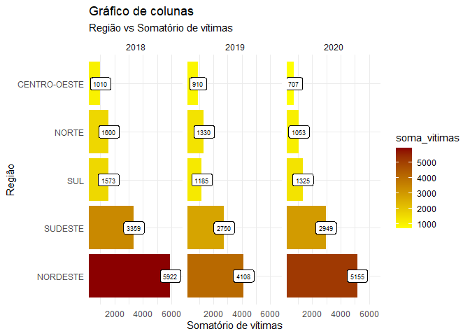
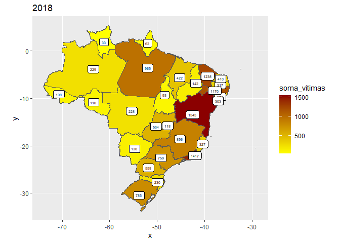
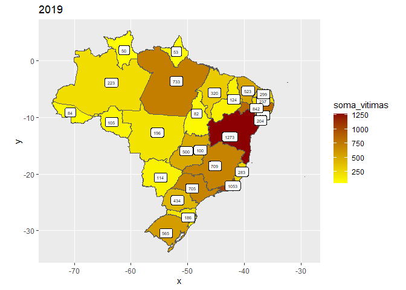
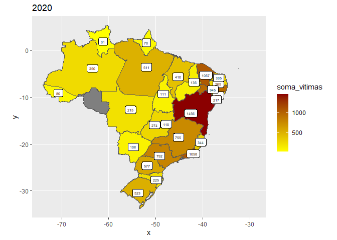
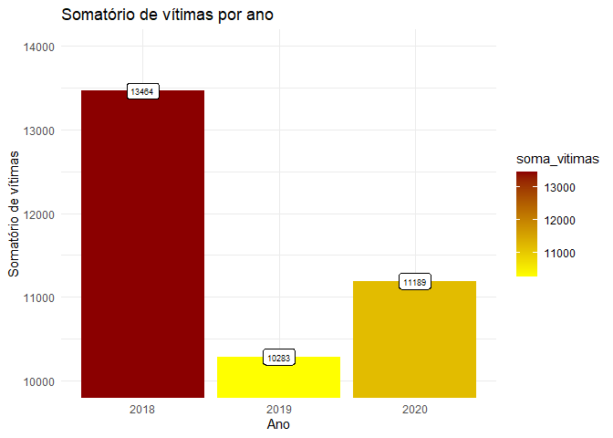

<!-- README.md is generated from README.Rmd. Please edit that file -->

# Curso-R para Ciência de Dados II

## Avaliação Final - Análise de variáveis de segurança pública nacional

### Aluno: Gabriel Caldana

<!-- badges: start -->

<!-- badges: end -->

Neste documento vamos analisar a base de dados do Sistema Nacional de
Informações de Segurança Pública (SINESP) Nela temos o número de vítimas
de crimes violentos em regiões brasileiras e subdivididas em estados.

A partir dessa base, os primeiros três meses (janeiro, fevereiro e
março) serão filtrados dos anos de 2018, 2019 e 2020 para fins de
comparação igualitária.

\===============================================================================================

## Dividindo por Região

Comparando as mesmas regiões em números absolutos em função do total de
vítimas no período, temos os seguintes gráficos:

<!-- -->

Podemos observar que as regiões Centro-Oeste e Norte tiveram redução no
número de vítimas com o passar dos anos.

As regiões Sul, Sudeste e Nordeste tiveram uma melhora significativa de
2018 para 2019. Mas, infelizmente, é um indício de que a quarentena não
ajudou a diminuir os índices de violência em nessas regiões, pois de
2019 para 2020, o número de vítimas cresceu bastante.

\===============================================================================================

## Dividindo por Estado

Para entender a geografia da criminalidade violenta no Brasil, a mesma
idéia de comparação dos gráficos acima foi adotada para a formulação de
mapas de calor.

Abaixo temos três mapas do Brasil , um para cada ano desta análise,
divididos por estados. Quanto mais claro, menor é o total de vítimas
daquele estado; quanto mais escuro, maior é o número total de vítimas.

<!-- --><!-- --><!-- -->

Os mapas de calor demonstram os resultados dos gráfico da sessão
anterior. Alguns estados chamam bastante atenção como o Pará, Goiás, Rio
de Janeiro e Rio Grande do Sul. Esses tiveram uma melhora muito visível,
com suas cores ficando mais claras com o passar dos anos.

Em contrapartida, vemos alguns estados como o Ceará, Bahia baixando a
criminalidade violenta de 2018 para 2019, porém aumentando de 2019 para
2020.

\===============================================================================================

## Criminalidade geral no Brasil

Para enxergar a criminalidade no Brasil como um todo, podemos observar a
tabela abaixo que sumariza o valor total de vítimas de crimes violentos
no país em cada ano analisado.

<!-- -->

Dentro do contexto nacional, podemos sugerir que a criminalidade não
diminuiu com o início da quarentena. Com um aumento de 906 vítimas em
relação ao ano de 2019, 2020 teve um aumento de quase 2,5 casos por dia.

Ao calcular a média de vítimas dos anos de 2018 e 2019 obtemos um valor
(11.873) maior que o de 2020 (11.189).

Essas diferenças poderiam sugerir que há uma flutuação nos números
totais considerada normal e que pode afetar as conclusões neste estudo.
Para ter certeza de que a flutuação está ou não afetando na análise,
teríamos que aferir a significância da diferença dos dados através de
teste estatístico.
